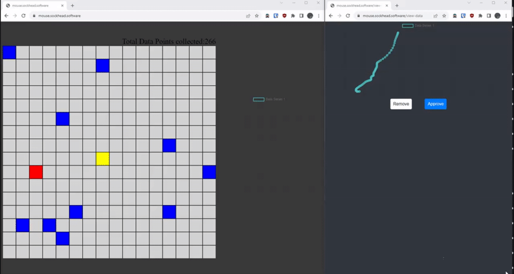
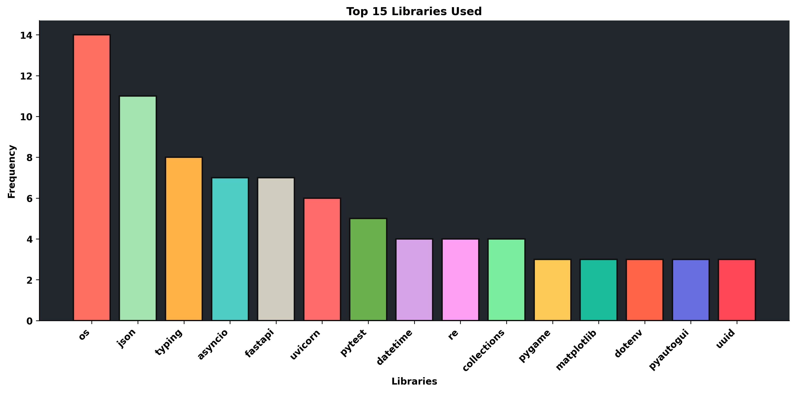

👋 Hi, I'm Ryan, an industrial and commercial electrician with over a decade of hands-on experience. Despite my roots in electrical work, I've been captivated by the world of software and web development for quite some time.

💻 My journey into the realm of programming led me to become a Python enthusiast, but I have exposure to several languages. I find joy in crafting elegant solutions and diving deep into a language's versatility and capabilities. On the client side, I've developed a notable affinity for Svelte, but feel comfortable in vanilla JS and I'm confident I could apply my skills to any front end framework or library.

🚀 What fuels my passion? The thrill of learning and adapting to new technologies and frameworks. I believe in staying at the forefront of industry trends and continuously challenging myself to be exposed to the latest tools.

⚡ Beyond code, I also like to I combine my expertise in electrical, electronics and peripheral IO to create interesting solutions. Embedded computing and physical hardware synergize well and not only satisfies my curiosity but also opens up a realm of possibilities for creative problem-solving.

🔧 Dont be afraid of making PR's or opening discussions on any projects I have! Communication, community and teamwork are essential to the collaborative nature of open-source development. Your insights, feedback, and contributions are highly desired and valued.

 
 

            
 

# Current Projects:

## AiMouseMovement

A project with a simple web client interface for collecting cursor path data. The goal is training an ML model to discern between human and artificial cursor movement as well as generating artificial movement that is indistinguishable from human cursor behavior.

[Visit the client side data gathering tool](https://mouse.sockhead.software)

## Dashboard

A Dashboard/Homepage web application that has some handy features like weather, time, bookmarks, notes and available service communication protocol to interact with standalone service clients

# 📊 GitHub Stats:

 
 

## 🏆 GitHub Trophies

---

# 📊 Python Stats:

### Data last generated on: 2024-07-12

## Top Libraries Used

## Project Metrics

- Total Lines of Python Code: 9400
- Total Libraries/Modules Imported: 104
