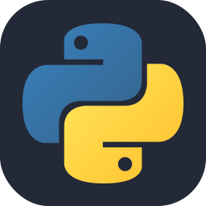
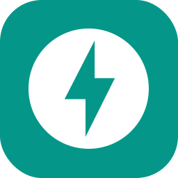
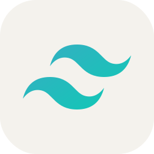
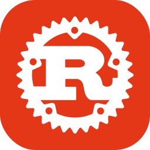
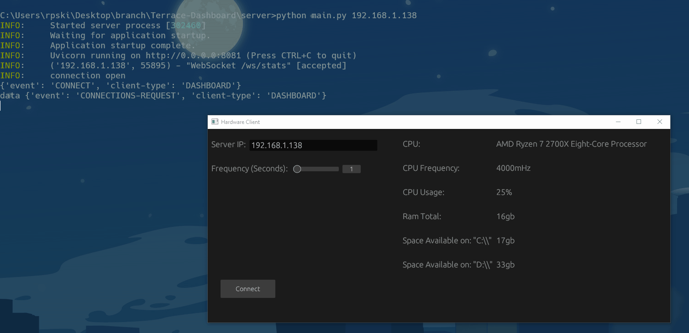

"I'm Ryan, a software and web developer from Ohio. I have over 10 years of experience as an industrial and commercial electrician, but I have had a passion for development for twice that time. I'm primarily a Python enthusiast, with a notable affinity for Svelte when working on the front end, but I thoroughly enjoy learning and adapting to new technologies and frameworks.". 
 
             
 

# Current Projects:

## Dashboard:    

A Dashboard/Homepage web application that has some handy features like weather, time, bookmarks, notes and available service communication protocol to interact with standalone service clients

## Hardware Client 

A hardware client written in Rust that communicates hardware statistics about the host

# 📊 GitHub Stats:

 
 

## 🏆 GitHub Trophies

---

