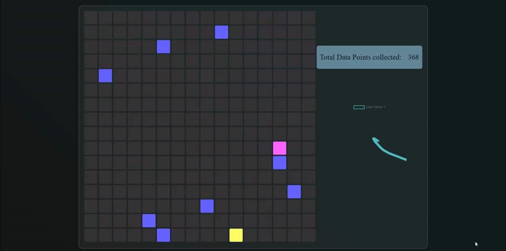

           
 

# Current Projects:

## AiMouseMovement

A project with a simple web client interface for collecting cursor path data. The goal is training an ML model to discern between human and artificial cursor movement as well as generating artificial movement that is indistinguishable from human cursor behavior.

## Dashboard

A Dashboard/Homepage web application that has some handy features like weather, time, bookmarks, notes and available service communication protocol to interact with standalone service clients

# 📊 GitHub Stats:

 

## 🏆 GitHub Trophies

---

### Data last generated on: 2024-09-12 via [GitHub Action 10825015765](https://github.com/sockheadrps/sockheadrps/actions/runs/10825015765)

## 🚀 Recent Commits

- **PyProfileDataGen - [Merge pull request #10 from codingwithstrangers/main  Making this for a PR - codingwithstrangers Workflow updates](https://github.com/sockheadrps/PyProfileDataGen/commit/f97c780a478a95e7f9e8ad2d8be74b7716cec1d7)**
  - Additions: 28 - Deletions: 3 - Total Changes: 31

- **PyProfileDataGen - [Making this for a PR](https://github.com/sockheadrps/PyProfileDataGen/commit/1d9f3db7552a8237c1ce9342cb6891bb2920609c)**
  - Additions: 28 - Deletions: 3 - Total Changes: 31

- **rpaudio - [0.0.5](https://github.com/sockheadrps/rpaudio/commit/1ddc3dd4d6bac5bc8039661cbc2d76f76f4f221f)**
  - Additions: 1 - Deletions: 1 - Total Changes: 2

## 🔀 Recently Merged Pull Requests

- **[Feature/documentation](https://github.com/drinkincode/dungeon-of-ursina/pull/6)**
  - Repository: [dungeon-of-ursina](https://github.com/drinkincode/dungeon-of-ursina)
  - Stars: 0

- **[requirements.txt](https://github.com/drinkincode/dungeon-of-ursina/pull/2)**
  - Repository: [dungeon-of-ursina](https://github.com/drinkincode/dungeon-of-ursina)
  - Stars: 0

- **[Sounds.ext fixes](https://github.com/PythonistaGuild/TwitchIO/pull/454)**
  - Repository: [TwitchIO](https://github.com/PythonistaGuild/TwitchIO)
  - Stars: 789

# 📊 Python Stats:

### Total Lines of Python Code: 10961
### Total Libraries/Modules Imported: 103
### Total Python Files: 128

