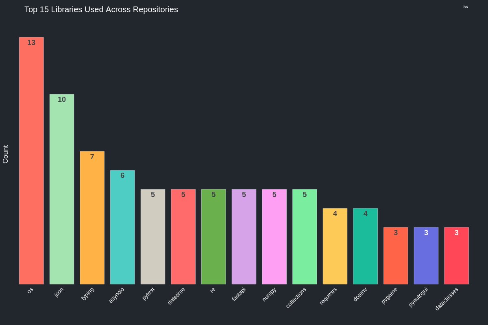

 
 
 
 

 
 
 
 

 
 

### ***[Rpaudio]()***
    
***Python binding written in Rust for interfacing with and managing audio.***

###  [***PyProfileDataGenertor***](https://github.com/sockheadrps/PyProfileDataGen)
  
***A tool for data analysis and visualization creation/aggregation for representing code and the technical datapoints to automatically deploy to your Github Profile.***

 
 

 

## 🏆 GitHub Trophies

---

### Data last generated on: 2024-09-27 via [GitHub Action 11067016857](https://github.com/sockheadrps/sockheadrps/actions/runs/11067016857)

## 🚀 Recent Commits

- **RpaudioFastAPIExample - [Merge pull request #1 from sockheadrps/channels  Channels implementation (audio queue)](https://github.com/sockheadrps/RpaudioFastAPIExample/commit/6c6127e849453d18521f782ee10f1303f32021e4)**
  - Additions: 144 - Deletions: 29 - Total Changes: 173

- **RpaudioFastAPIExample - [basic channels with sync effects](https://github.com/sockheadrps/RpaudioFastAPIExample/commit/be85fb7ab5a8185bce76889f9050b2aa6fc2437b)**
  - Additions: 13 - Deletions: 3 - Total Changes: 16

- **RpaudioFastAPIExample - [working on implementing channels, as the rpaudio.AudioChannel feature gets fixed...](https://github.com/sockheadrps/RpaudioFastAPIExample/commit/1acb58cb75de81826afd9c6103fdb181468cd40f)**
  - Additions: 133 - Deletions: 28 - Total Changes: 161

## 🔀 Recently Merged Pull Requests

- **[Feature/documentation](https://github.com/drinkincode/dungeon-of-ursina/pull/6)**
  - Repository: [dungeon-of-ursina](https://github.com/drinkincode/dungeon-of-ursina)
  - Stars: 0

- **[requirements.txt](https://github.com/drinkincode/dungeon-of-ursina/pull/2)**
  - Repository: [dungeon-of-ursina](https://github.com/drinkincode/dungeon-of-ursina)
  - Stars: 0

- **[Sounds.ext fixes](https://github.com/PythonistaGuild/TwitchIO/pull/454)**
  - Repository: [TwitchIO](https://github.com/PythonistaGuild/TwitchIO)
  - Stars: 791

# 📊 Python Stats:

### Total Lines of Python Code: 11706
### Total Libraries/Modules Imported: 103
### Total Python Files: 133

